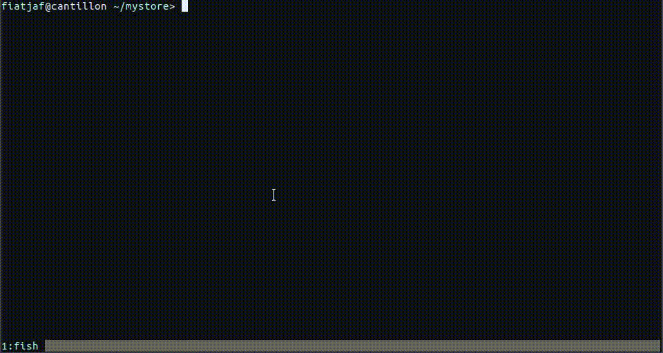

# pf



**pf** is a (for now) a command line tool that let's you turn sentences into structured data of any format you want by using a simple parser syntax.

Let's say you have a fabric store, a physical fabric store, and you want to keep track of all your finances and inventory. The only information you have are the raw facts that happened at your store, as they happen, and that's the only thing you need. So imagine that during the day you'll add facts like the following:

```
pf facts add 'sold 2m of cashmere for 104 bucks'
pf facts add 'sold 4m of wool for 150 bucks'
pf facts add 'got 100m of cashmere delivered'
pf facts add 'paid 200 to cashmere supplier'
pf facts add 'sold 6m of cashmere for 312 bucks'
pf facts add 'paid 250 to employee Maria'
```

After that (or before, it doesn't matter) you would define rules (by calling `pf rules add` or `pf rules edit`) to handle the 3 kinds of facts listed above with patterns somewhat like

```
'sold <quantity:number>m of <fabric:words> for <amount:money> bucks'
'got <quantity:number>m of <fabric:words> delivered'
'paid <amount:money> to <whom:words>'
```

When you call `pf compute` each fact is run, in order, through each available pattern and, if matched, the rule script is run. Each rule script receive the parameters captured in the fact parsing and the fact timestamp and can read and modify the current `state` (which begins as an empty JSON object `{}` by default). So for the "sold ..." rule you would perhaps

  * add the sale data to a big list of sales
  * add the value to your cash balances
  * subtract the sold items from your inventory

for the "got ..." rule you would

  * add the received items to the inventory

and for the "paid ..." rule you would

  * subtract the paid value from the cash balances
  * if the value was paid to an employee, keep track of your payments to that employee

Then you end up with a JSON object with all the data you need and you can use different tools, like [jq](https://stedolan.github.io/jq/), to crunch the data and produce reports, charts, prints and other useful stuff.

If you decide later to start keeping track of things in a different way or to change your schema entirely, you just have to rewrite your rules, the facts will continue to be the same.


### install

```
npm install -g pf-cli
```

---

This is an idea under development. The CLI program works, but much more functionality will be added yet, most notoriously:

  * [ ] incremental computing of facts
  * [ ] initial data loading and checkpoint saving
  * [ ] better logs and rule debugging helpers
  * [ ] [PouchDB](http://pouchdb.com/) sync
  * [ ] a web client, at least for fact inputting, so normal people can use it on predefined schemas
  * [ ] fact input autosuggest based on the rule patterns structure
